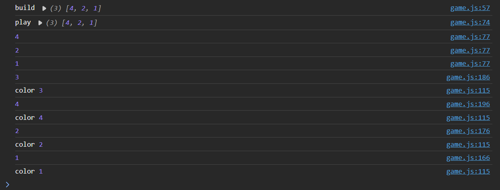

# Charlie says

## Project 2

---

Charlie says is an interactive game of simon says.

Live Site https://tropicalbunny.github.io/Project-2

## Table of content

- [UX](#ux)
  - [User stories](#user-stories)
    - [New User Goals](#new-user-goals)
    - [Returning User Goals](#returning-user-goals)
  - [Project Goals](#project-goals)
  - [Minimum Acceptance Criteria](#minimum-acceptance-criteria)
- [Development](#development)
  - [Design](#Design)
    - [Notable Design Decisions](#notable-design-decisions)
- [Testing](#testing)
    - [During Code Testing](#during-code-testing)
    - [Final Testing](#final-testing)
      - [User Testing](#user-testing)
      - [Personal Testing](#personal-testing)
  - [Features implemented](#features-implemented)
  - [Planned Features](#planned-features)
  - [Technologies Used](#technologies-used)
  - [Issues](#issues)
    - [Known Bugs](#known-bugs)
    - [Fixed Bugs](#fixed-bugs)
- [Deployment](#deployment)
    - [Process](#process)
    - [Encounted Issues](#encounted-issues)
- [Credits](#credits)

# UX
----
## User Sories
The main end user goal is to have a fun, stress free time.

### New User Goals

* I would expect a bug free game
* I would expect clear intructions on the game and how it works
* I would like a sleek design that is clear and easy to navigate

### Returning User Goals

* i would like to be able to dive staight into the game without needing to see the info screen

### Project Goals

the main goal of this website is to create a positive, fun experience that will keep players returning

* Simple design that is easy to navigate for all ages

### Minimum Acceptance Criteria

* Simple sleek bug free design
* user friendly across devices

# Development
----

## Design

This was the basic idea i was trying. Originally i wanted to go for a retro style game with a game input board, however i decided this was too bulky and not really easy to navigate. i decided to recreate with the idea below.

This is the final idea i settled with. minimalist and easy, i felt this created a more positive enviroment for people to enjoy the game.
in this i removed the input board and decided to use the central buttons instead

### Notable Design Decisions
* I moved the info screen to a button press in both the main menu and in game. this was so returning users didnt need to see it every time they replayed, this also meant i could keep it there incase people needed reminding of the controls.
* I have seperated the game code from the "core" code, this is so the user does not load the game until they move onto the game screen. saving on loading time and bandwidth.

## Testing
---
### During Code Testing

I consitiently used "console.log" to keep an eye on each function, i labeled them as well so i knew at want point in the function they triggered. this helped me understand where variables where being missed.

i had a major issue where the listeners would duplicate, to solve this i seperated each listener into their own function. allowing me to freely add and remove them based on whether it is the players turn.
 

here you can see i held all of the code for what the listeners needed to do under one function.
 

here i rewrote it so that the listeners called thier own function, this meant i could precisely change when i wanted the listeners active or not.

### Final Testing
---
#### User Testing

I had some issues when checking on a samsung s10, the text was not making itself small. little modification to the code and now its sorted. 

#### Personal Testing

* Checked the functionality of the game, and confirmed it is working
* Used EDGE built in function to sest across multiple devices and confrimed they work.

My code has passed both the jogsaw css validator and the html code validator from w3c schools.

## Features Implemented
The game consits of two webpages accessable through buttons.

#### Seperate information 
I kept the information screen in a seperate popup, this is so returning users do not need to see it, i also added a button on the game itself so you can refer back if you need too.
#### Landing Page
I created a landing page so you didnt immediately land into the game, this was a personal choice as i like to have a main menu before diving into a game.

## Planned Features
i have a few planned features that didnt make it into this final build
* A colourblind mode, where numbers are added to the segments.
* Quirks, little changes in the game to add a sense of wimsicle difficulty
* Seperate difficulty levels, that added extra buttons to the main menu allowing you to pick from easy medium or hard, this would add extra segments you can click from.

## Technologies Used
* HTML 5
* CSS 3
* JAVASCRIPT
* jQuery
* Font Awesome
* Figma
* Github
* Gitpod
* Virtual studio

## Issues
---
### Known Bugs
* font does not load on s10, updated to have the font as a file. this did not fix the issue. as this bug couldnt be recreated on other devices i decided more testing on similar devices is needed, for which i do not have access.
* Notes on Phones randomly stop functioning after round 2. I had trouble consitently recreating this bug so it has been difficult to track down, I decided that this is a bug that will be fixed in future updates as this does not affect core functionality.
* If you start the game too quickly the segments take a split second to load into the page, as this is a minor bug i belive i can fix this in a future update with "window.onload". but as of now it does not affect functionality.
### Fixed Bugs
* Game array wasnt writing outside of function.
* Segments where enlarging while game was lighting them
* Code double running on round 2

## Deployment

---

### Process

Process for deploying a front end website was fairly easy. as i have all my commits and main branch on Gitpod it made the most sense to deploy on there as well, i used their deployment Gitpod Pages.

The Deployment of the project was as follows:

* Use this link https://github.com/Tropicalbunny/Project-2 to get to my repo, login as yourself and click code
* Clone a copy for yourself
* Once you have a copy, head to settings on the navigation bar.
* Under code and automation, click pages
* You change source to "deploy from branch"
* The branch will be "main" and "/root" you then click save.
* The deployment process can take a few minutes, let this complete you can see the progress on the code page under Enviroments.

### Encounted Issues
Luckily i had no deployment issues, all deployed as expected

# Credits
---
## Code aid
* StackOverflow
* StackAbuse
* Pasquale Fasulo(COBC Tutor)
* https://marcgg.com/ for the js created tune code

## Testing
* My Team At PML
* Family Programmers